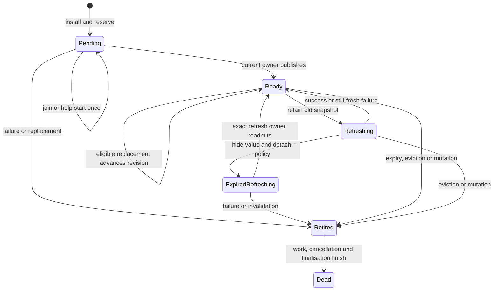

# Concurrency and ownership

The shared engine backs four personalities. Physical file boundaries do not create independent owners; the authoritative map, flight/publication rights and policy metadata have separate contracts. Race tests are evidence, not a formal proof or a substitute for CLR publication reasoning.

## Authority and states

`EntryStore` wraps BCL `ConcurrentDictionary`. Every entry has reference identity, epoch and generation; value-sensitive operations additionally check publication/variable revisions. Deques, TimerWheel and buffered events are derived metadata. Completion checks disposed state, epoch, exact mapping and flight under the engine gate. Conditional removal uses the exact key/entry pair, never check-then-unconditional-remove.

Ready is not queue membership. Pending cold loads consume no resident weight. Initial cold publication sets value, timestamps, weight, shared task and policy token under entry ownership, then release-writes `IsReady`. A directly ready entry is completely initialised before dictionary publication.

Weak-key storage uses `ConcurrentDictionary<object, Entry>` with stored stable identity-hash weak wrappers. A raw caller key is used only for lookup, never inserted or retained in a thread-local registry. The comparer handles raw/wrapper comparisons symmetrically; the same dead wrapper still equals itself, distinct dead wrappers do not. Exact entry removal remains valid after collection. Strong storage retains its generic path. Weak-value ready entries do not retain completed tasks rooting their values.

## Lock order and shared fields

| State                                                     | Owner/publication contract                                                                                                                                   |
| --------------------------------------------------------- | ------------------------------------------------------------------------------------------------------------------------------------------------------------ |
| Map mutation, epoch, flight installation and reservations | Engine gate; active registry spans clear epochs.                                                                                                             |
| Entry value/task/revisions/retirement                     | Entry monitor; coordinated mutations acquire engine then entry. Narrow resident replacement can use entry alone, releasing it before any engine/policy work. |
| Start and backend terminal claim                          | Per-flight once/atomic state; joiners can help start installed work.                                                                                         |
| Bulk promise completion                                   | Separate short group gate, never nested with engine gate; bounded internal TCS/monitor signalling only.                                                      |
| Policy/deques/sketch/write buffer                         | Engine/adapter/write buffer share one monitor. Exact token pending counts and node sequences belong to it.                                                   |
| Wheel and normalised time                                 | Engine gate, at most 128 node visits per pass.                                                                                                               |
| Expiration timer arm/dispose                              | Expiration-timer gate → engine gate; mutation releases engine before requesting a timer. Stop timers outside engine mutation.                                |
| Timer running/re-arm                                      | Interlocked/Volatile ownership flags, one cache timer.                                                                                                       |
| Runtime TTL/TTI duration                                  | Volatile reads/writes; setters coordinate and re-arm.                                                                                                        |
| Variable read expiry                                      | Callback outside locks, then engine → entry validation of identity/revision.                                                                                 |
| Owned values                                              | Engine → entry → ownership gate. Never ownership → engine while nested.                                                                                      |
| Notifications                                             | Capture under engine → notification gate; release all gates before dispatch.                                                                                 |
| Loader chain                                              | AsyncLocal with finally restoration; detects logical-chain cycles only.                                                                                      |
| Statistics                                                | Bounded striped atomic counters and independently owned gauges; weak snapshots.                                                                              |

Entry-only readers release their monitor before requesting engine coordination. Engine-coordinated fallback can retire another entry while holding an entry monitor, but the outer engine gate serialises such mutation. Parallel resident writers touch only their own entry under that lock. User loaders, weighers, expiry/listener/disposal callbacks and cancellation callbacks execute outside internal locks. Comparers and timestamp providers are explicitly required to be fast, stable and non-reentrant.

Async shared promises are Tasks with `RunContinuationsAsynchronously`; public ValueTasks are per-call containers. Synchronous loading uses its own monitor completion without awaiting arbitrary user tasks. No lock contains await, `.Wait()` or `.Result`.

## Atomic resident and fixed-write reads

The no-time-policy atomic path requires strong keys/values, no automatic refresh or ownership, and reference/Int32/Int64 values. Read the single value with BCL Volatile acquire; every set, explicit refresh, bulk and rollback value write uses a matching release. Type guards, not size guesses, justify aliases. Do not tear arbitrary structs or pretend several mutable fields form one atomic snapshot. Task views and other value types keep synchronised pairing. Policy views cannot enable absent construction-time expiry later. No-expiry reads do not consult a clock.

Strong write-only expiry without automatic refresh/ownership uses `Entry.PublishedWrite`, an immutable value/timestamp publication. Initial atomic values may remain in the entry with a null marker; initial larger structs always use a snapshot. Before the first explicit refresh modifies any fields, `Interlocked.Exchange` installs the old immutable snapshot with a full fence. Publish the new snapshot with release; never return to null or reinstall an old snapshot identity.

Readers obtain publication P, current duration D, then time, and recheck P plus non-retirement. P and D coexisted at the duration read; later time is conservative. The null path also rechecks its marker, preventing torn initial value/time during upgrade. Conflict/expiry/task lookup reselects the mapping under engine → entry; an absent/pending replacement is a miss, not expired-resident cleanup. Rollback creates a new snapshot preserving the old deadline. TTI, variable, weak and owned modes retain their own coordinated freshness paths.

Access advancement compares the sign of unchecked raw timestamp delta before conversion: a negative sub-tick delta rounded to zero must not move time backwards. System timing uses BCL Stopwatch conversion; custom TimeProvider semantics remain respected.

## Replacement, conditional mutation and rollback

Stable reuse requires built-in policy, strong references, no time policy/automatic refresh, no flight and equal weight. Update value/revisions/task view under entry ownership. Old recency events still describe continuous residency, but dictionary/pressure/rollback operations must validate value revision, not just the physical entry.

The entry-only replacement path additionally requires no listeners/owned callbacks and construction-time absence of bulk capability. Recheck disposed/epoch, exact mapping, ready/retired/detached/pending state, flight and weight inside the monitor. Publish first, then record counters/recency and finish the reliable-write boundary after unlocking. Zero active bulk groups is insufficient; bulk-capable instances always use the coordinated mutation journal. Internal construction is conservative unless explicitly opting out.

`PublicationPending` is set before mapping/value visibility and cleared only after policy/wheel bookkeeping succeeds. Failure leaves it set so later replacement performs physical repair. Conditional compare/update/remove holds the same entry ownership from final version/freshness validation through commit/retirement. Equality/weight/expiry callbacks are outside locks.

Missing transforms use a mutation sequence and rollover era. Record successful detach before pending-entry returns or fallible policy/notification work, including exceptional refresh detach; explicit absent invalidation records intent. Capture after the snapshot's own stale cleanup to avoid self-induced retry. Logical self-mutation has a separate marker. See ADR0012.

Delayed expired/collected read cleanup captures `PublicationRevision`, then rechecks identity, revision and _current_ freshness/collection under engine → entry. Duration extension can invalidate cleanup without a revision change. The old read may still return miss but cannot remove a newer/fresh version.

Refresh rollback is itself a new publication: advance publication/variable revisions and create a fresh immutable identity while restoring old data/deadline. A failed publication's snapshot must not match a future version through ABA. Cold rollback and bulk failure remove only their exact published revisions. Bulk records revision before clearing flight/fallible initialisation. If a surviving ready value would otherwise expose a failed cold task, exceptional rollback installs a successful completed task for that value; normal shared task identity is preserved.

## Flight finalisation and shutdown

Limits are optional, but disabling them does not remove registry/reservation ownership. `int.MaxValue` represents an unconfigured integer ceiling, not preallocated storage. Installation and join are separate from starting; helpers prevent a paused installer stranding work.

Clear advances the epoch and uses dictionary clear/reset under the mutation gate, not enumeration/removal. Old work retains necessary entries/context, never the old full map. Disposal closes admission/publication before outside-lock cancellation and bookkeeping. User work may continue but has no late publication rights.

Backend `TerminalClaimed` is not promise completion. After claiming, failures must use claimed-failure handling instead of losing signalling through another CAS. Bulk success performs bounded result lookups outside its completion gate and waits for its own eviction callbacks before ordinary success. Shutdown can first complete every still-pending per-key/owner promise consistently while the backend owner is blocked. The group's completed flag is last; no callback, cleanup, comparer or engine-gate acquisition belongs inside this gate.

Timeout retains the registry until `UnderlyingCompleted`, `CancellationCleanupCompleted` and `TimeoutFinalizationCompleted` all hold and promises are terminal. The running gauge can decrease earlier. The timeout owner marks finalisation incomplete under engine coordination, performs timer cleanup/signalling, then retries retirement. Cancellation cleanup cannot impersonate timeout finalisation, including synchronous flights without linked CTS.

Retirement has two phases: claim/detach once under the engine gate, attempt timer/CTS cleanup outside it while retaining C/F and registry, then complete terminal bookkeeping. Ordinary promise completion and final reservation removal share the short engine gate, avoiding a spurious rejection of an immediate continuation's next load. Bulk and engine gates never nest. Final shutdown CTS disposal is outside locks.

Timer-disposal errors are observed secondary faults, counted through `MaintenanceFaults` when enabled without changing selected outcomes or valid publication. Capture loader token before arming: a custom timer may fire synchronously. Detach active timers during shutdown and dispose outside the gate. No promise registry may disappear before a potentially blocking custom timer cleanup, and disposal never waits for arbitrary backend/token/listener work.

## Bulk, listeners and owned values

Bulk installs keys/C/F together and associates existing owners with groups without historical key roots. Copy/validate output outside locks, then fence each key. Prefetch checks epoch/journal token/start sequence and same-key mutation; the bounded 1,024-key journal rotates on overflow and uses weak wrappers where required. Requested results do not depend on prefetch journal capacity.

Eviction events belong to their synchronous operation. Capture exact value versions inside coordination, dispatch outside all locks before normal result completion; another thread cannot steal callbacks or force shutdown to wait for them. Nested callbacks own separate scopes, scopes never cross await, and finally clears thread roots. Removal events use a bounded capture queue and an unsafe ThreadPool handoff before calling an injected dispatcher scheduler, preventing inline user execution under the engine gate. Observable Metrics callbacks run during collection, not mutation.

Owned mode atomically acquires generation plus operation lease under its ownership gate, releases it before engine/weigher work, and retires with trusted reference bookkeeping only. Lease disposal exchanges one complete registration atomically. Disposer requested/scheduled/completed states remain distinct; rejection preserves bounded pending work, retry never duplicates scheduled work. Owned lookup uses engine coordination to protect acquire/remove; ordinary raw-value hits do not inherit that cost.

## Read/write maintenance

Reliable writes use a 256-event queue and a separate coalesced write signal. Commit/enqueue/drain/clear share the engine gate. Events carry exact token and sequence; superseded events cannot admit/remove current versions. Full producers drain/retry. Initial/re-arm rejection and drain faults have bounded reliable fallback; clearing a lossy-read retry signal cannot strand a write. Synchronous eviction listeners force capture in the original operation. See ADR0013 and the numerical [resource model](resource-model.md).

Reads use lazy CAS stripes, 64 slots each, up to four times the next power of two of CPU count. Accepted idle reads are delayable until full, reliable write or cleanup. The cold-start bypass flag is synchronised by the policy owner when sketch initialisation changes; once enabled it stays enabled for that generation, including reduced residency. Clear creates a replacement policy and resets the flag before publication. Old readers still carry retired tokens, never new rights.

Producer reservation is not publication. Write payload, full-fence `Interlocked.Exchange` the sequence, then acquire-read disposed. Release-store followed merely by acquire-load would allow a store-buffer double miss between producer and disposer. Consumer acquires sequence, extracts/clears the exact payload and releases its slot sequence under policy → consumer gate, publishing the batch read cursor in finally even on internal callback failure. Ordinary producers take no consumer gate. An unpublished head stops only its stripe; other stripes progress.

Dispose claims ownership by CAS, detaches tables/storage, clears every slot value under the consumer gate and uses sequence CAS for one shutdown-drop owner. Late producers also check the read cursor to avoid capacity-one sequence-reuse confusion, then self-clear under consumer exclusion when needed. Publishing a new ring into a table also uses a full-fence exchange followed by outer-disposed checking; initial/expanded tables use CAS. Retired numeric statistics cannot retain event arrays. A paused producer may retain its own argument, not unrelated queued payloads.

Full/Failed counters are shared bounded numeric shards, counted once per terminal drop, only with statistics/Metrics enabled. Intermediate retry is not another drop. Queued scans published sequences including those behind a hole; `HasPublished` means an immediately readable head. Snapshot one live-or-retired table and aggregate shared shards once, avoiding expanded-table double counting. These gauges do not rely on cumulative counters.

Coordinator states are Idle/Scheduled/Running/RunningRequired/Disposed. Each actual owner claim advances generation and clears old inline markers under its gate. A scheduler returning outside the gate must revalidate generation before rejection/re-arm changes; the enum alone is vulnerable to reuse. Drain callbacks run outside the coordinator gate, with at most 256 reads/256 writes per pass and a finite invocation budget. Default scheduling enqueues the reusable `IThreadPoolWorkItem` without context capture; ownership, not callback identity, excludes duplicate workers. Injected inline schedulers trigger bounded fallback rather than recursion.

A pass replays available reads before queued writes/eviction; this is approximate policy ordering, not a total access order. Write-pressure flush has its own reliable boundary. Handoff checks consumable heads, not reservations, avoiding infinite re-arm on paused producers. Rejected fallback clears read retry state so later full offers can schedule again. Quiescent cleanup drains completed publications; no freshness depends on read replay. Variable-expiry callback commit still uses the engine gate and has a distinct contention cost.

Controlled tests cover ABA, installer pauses, finalisation, shutdown publication ordering, counter wrap, stale epochs, full queues, re-arm rejection, owner reuse, wheel tails and weight overflow. Keep hardware/platform evidence separate from abstract ordering counterexamples and deterministic schedules. [Release readiness](release-readiness.md) identifies what actually ran.

## Maintenance test scheduling

Workers that deliberately block on publication hooks, barriers or a manual scheduler gate
use `TaskCreationOptions.LongRunning` with `TaskScheduler.Default`. Their peers must be able
to start without ThreadPool worker injection. Default-scheduler tests still exercise the
real ThreadPool; the five-second watchdogs and concurrency assertions remain unchanged.
